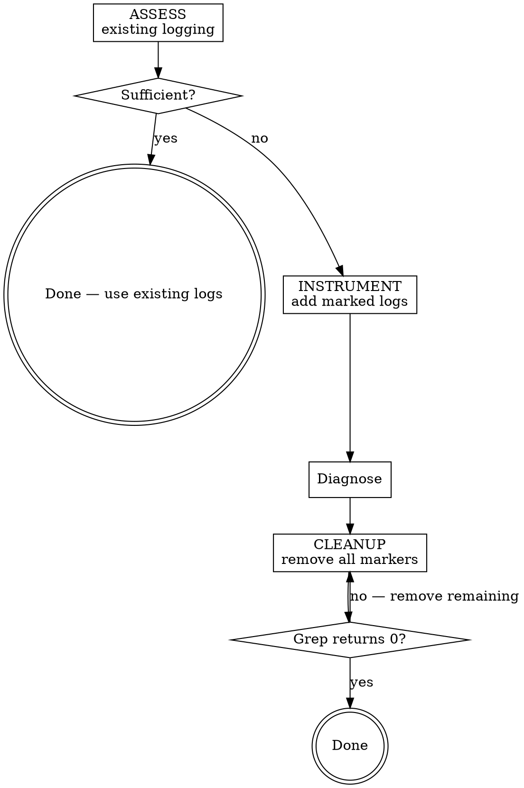

# Debugging with Logs

## Overview

Temporary diagnostic logging is a powerful debugging technique — but only when it is **targeted, marked, and cleaned up**. Unmarked debug logs get lost, scattered logs create noise, and leftover logs pollute production.

**Core principle:** Every debug log you add MUST be removable in one grep. If you can't remove all your logs in one pass, you've already failed.

**REQUIRED BACKGROUND:** `superpowers:systematic-debugging` — this skill is a technique within the broader debugging process, not a replacement for it.

## When to Use

- Existing logging is insufficient to diagnose a bug
- You need to understand data flow through unfamiliar code
- You want to verify assumptions before a refactor
- Within `superpowers:systematic-debugging` Phase 1 when evidence gathering needs instrumentation

**Also use when you catch yourself:**
- Adding `console.log` / `print` without a plan
- Scattering logs "everywhere" hoping to find the issue
- About to add logs under time pressure without thinking about cleanup

## The Three Phases



### Phase 1: ASSESS

**Before adding a single log, survey what exists.**

1. Read the logging in the problem area — what is already logged?
2. Check log configuration — are existing logs actually reaching output? (log levels, handlers, silenced loggers)
3. Run the failing scenario and read the existing log output
4. Decide: can you diagnose with existing logs, or do you need more?

**If existing logs are sufficient, stop. Do not add more.**

This phase is NOT optional. Skipping it under time pressure is the #1 failure mode.

### Phase 2: INSTRUMENT

**Add targeted, marked logs.**

**The Marker:** Every debug log you add MUST include the prefix `[DBG-TRACE]`.

```python
# Python
print("[DBG-TRACE] user_id={} payload={}".format(user_id, payload))
logger.debug("[DBG-TRACE] entering create_record, args=%s", args)
```

```javascript
// JavaScript/TypeScript
console.log("[DBG-TRACE] request body:", req.body);
logger.debug("[DBG-TRACE] db query result:", result);
```

```go
// Go
log.Printf("[DBG-TRACE] handler entry, userID=%s", userID)
```

**Where to place logs — boundaries first, then narrow:**

1. **Function/method entry and exit** — what goes in, what comes out
2. **Component boundaries** — API calls, DB queries, message queues
3. **Conditional branches** — which path was taken and why
4. **State before mutations** — capture values before they change

**What to log:**
- Variable values and types, not just "got here"
- Function arguments and return values
- Which branch of a conditional was taken
- Error objects fully (not just `.message`)

**What NOT to do:**
- Do not log between every line — log at decision points and boundaries
- Do not add logs without the `[DBG-TRACE]` marker. No exceptions.
- Do not modify existing log statements — add new ones only

### Phase 3: CLEANUP

**After the root cause is found, remove ALL debug logs.**

1. Search the entire codebase:
   ```bash
   grep -rn "DBG-TRACE" .
   ```

2. Remove every line containing the marker

3. **VERIFY — this is a hard gate:**
   ```bash
   grep -rn "DBG-TRACE" .
   # MUST return zero results
   ```

4. You CANNOT claim debugging is complete until the grep returns zero results.

**Cleanup rules:**
- Remove debug logs in the SAME session you added them
- Do NOT convert debug logs to permanent logging — that is a separate task with separate review
- Do NOT leave markers "for later cleanup"
- Do NOT commit code containing `[DBG-TRACE]` markers

## Red Flags — STOP

If you catch yourself:
- Adding logs without `[DBG-TRACE]` prefix → STOP, add the marker
- Adding logs without reading existing logging first → STOP, go to Phase 1
- Saying "I'll clean these up later" → STOP, clean up NOW
- Converting `[DBG-TRACE]` logs to production logging in the same session → STOP, that's scope creep. Remove them. File a separate task for logging improvements.
- Searching for `print(` or `console.log(` to find your debug logs → STOP, that catches existing logs too. Search for `DBG-TRACE`.
- Committing code with `[DBG-TRACE]` still present → STOP, run the grep.
- Saying "these logs are useful, let's keep them" → STOP. Remove them. If they're genuinely useful, add proper logging as a separate change without the marker.

## Common Rationalizations

| Excuse | Reality |
|--------|---------|
| "No time to assess existing logs" | You'll waste more time adding redundant logs and reading noise. Assess first. |
| "I'll just add a few prints without markers" | Unmarked logs are unfindable. You WILL forget one. Always mark. |
| "I'll clean them up later" | Later never comes. Clean up in the same session. |
| "This debug log is useful, I'll keep it as permanent logging" | Scope creep. Remove it. Add proper logging separately with proper review. |
| "I can find my logs by searching for print()" | That matches existing code too. Marker-based search is the only reliable method. |
| "The grep is overkill, I remember where I put them" | Memory is unreliable. 15 logs across 6 files — you WILL miss one. Grep. |
| "I'll just commit with the debug logs and clean up next commit" | Debug logs in git history is noise. Clean before committing. |

## Quick Reference

| Phase | Action | Gate |
|-------|--------|------|
| **ASSESS** | Read existing logs, check config, run scenario | Can you diagnose without adding logs? |
| **INSTRUMENT** | Add `[DBG-TRACE]` marked logs at boundaries | Every log has the marker? |
| **CLEANUP** | Remove all markers, grep to verify | `grep -rn "DBG-TRACE"` returns 0 results? |
