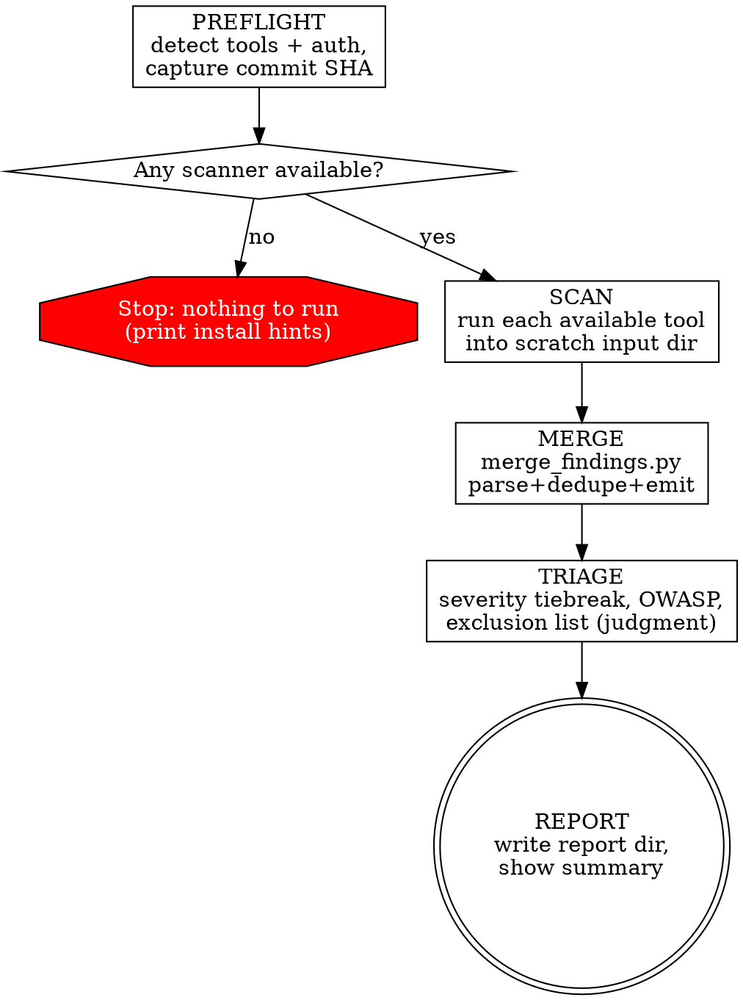

Run best-in-class, low-overlap security scanners over the codebase, merge and
de-duplicate their findings into one normalized report, and hand it to the user.
**Detect and report only — never fix, never invent findings, never claim coverage
that did not run.**

## Non-negotiable rules

**Violating the letter of these rules is violating the spirit of them.**

1. **Detect-only.** This skill produces a report. It does **not** edit source, apply
   patches, upgrade dependencies, or **offer to fix inline**. Remediation is a
   separate, user-directed task after they read the report.
2. **No LLM-invented findings.** Every reported finding comes from a real scanner
   (`merge_findings.py` guarantees each has a non-empty `source_tools`). You may
   normalize, dedupe, rank, bucket, and recommend — you may **not** add a finding no
   scanner produced, even one you're sure about from memory.
3. **Never claim coverage you didn't run.** A skipped or unauthenticated tool means
   its axis is **not covered** — never "clean". Absence of findings ≠ absence of
   vulnerabilities. Always list which tools ran vs. were skipped, and tie the report
   to a commit.

## Process flow



## Steps

### 1. Preflight

- Parse args: `--path <dir>` (default = whole working tree), `--with-semgrep`,
  `--verify-secrets`.
- **Detect available tools and Snyk auth state.** See `references/scanners.md` for
  the exact detection probes, run commands, and install hints. Print a one-line hint
  per missing/unauthenticated tool; do not hard-fail.
- Capture the revision stamp: `git rev-parse HEAD`, branch, dirty-state
  (`git status --porcelain`), and tool versions.
- If **no** scanner is available at all, stop and print install hints.

### 2. Scan

- Create a scratch input dir (use the session scratchpad, not the repo).
- Run each **available default** tool (Snyk Code, Snyk Open Source, Bearer,
  OSV-Scanner, Gitleaks) plus any **opt-ins** the user enabled, writing raw output
  to the exact filenames in `references/scanners.md`. Tools are independent — running
  them is parallelizable.
- Record which tools produced output and which were skipped (and why).

### 3. Merge (deterministic — do not hand-dedupe)

```bash
python3 <skill>/scripts/merge_findings.py <input-dir> <report-dir> --json
```

This parses every raw file, dedupes per category, assigns stable `F#` IDs, and writes
`findings.jsonl` + `merged.sarif`. **Use its output verbatim — do not re-derive or
add findings by hand.** If `orphan_findings` is non-empty, that's a script bug: report
it, don't paper over it. See `references/normalization.md` for the model and keys.

### 4. Triage (your judgment, bounded)

From the emitted findings only:
- Apply the **CVSS-wins** severity tiebreak and mark `severity: null` as **unrated**
  (never guess a severity).
- Bucket each finding into an **OWASP Top-10** category via its CWE.
- Move **exclusion-list** noise classes to a Skipped/excluded appendix (don't delete).

See `references/normalization.md` for the tiebreak, OWASP map, and exclusion list.

### 5. Report

Write the report dir (create if absent), default:
`~/Downloads/varno-devflow-security-scan/reports/<timestamp>/`

```
<report-dir>/
├── SECURITY-REPORT.md   # human report — the primary deliverable
├── findings.jsonl       # from merge_findings.py
├── merged.sarif         # from merge_findings.py (SARIF 2.1.0)
└── revision.json        # commit, branch, dirty-state, tools run/skipped, versions, scope, timestamp
```

`SECURITY-REPORT.md` contains: a **Summary** (counts by severity + category, tools
run, tools skipped *with why*, commit scanned); the **Findings** sorted by severity
then confidence — `ID · title · severity · confidence · OWASP · location/package ·
source_tools · exploit scenario · recommendation`; and the **Skipped/excluded**
appendix. Reports live outside the repo, so no `.gitignore` entry is needed.

Then show the user a short in-chat summary and the report path.

## Quick reference

| Axis | Default tools | Opt-in |
|---|---|---|
| Semantic SAST | Snyk Code | Semgrep (`--with-semgrep`) |
| Privacy / sensitive-data | Bearer | — |
| Dependencies / SCA | Snyk Open Source + OSV-Scanner | — |
| Secrets | Gitleaks | trufflehog (`--verify-secrets`) |

## Red flags — STOP

- About to write "the codebase is clean/secure" → only if **every** axis ran. Otherwise say what was **not** covered.
- About to add a vuln you know about but no scanner reported → **don't.** Not a finding.
- About to "quickly fix" or offer to fix a finding → **don't.** Report only; remediation is a separate task.
- About to hand-merge or re-rank findings instead of using `merge_findings.py` output → **don't.**
- Snyk unauthenticated and about to omit it silently → report it as **skipped — unauthenticated**.

## What this skill does NOT do

- **Does NOT fix, patch, upgrade, or offer to fix** — report only.
- **Does NOT invent findings** — every finding traces to a scanner via `source_tools`.
- **Does NOT claim coverage for tools that didn't run** — skipped ≠ clean.
- **Does NOT scan IaC/containers** (Phase 3) or diff-only/MR mode (Phase 2) yet.
- **Does NOT replace human security review** — it's a triage aid.
