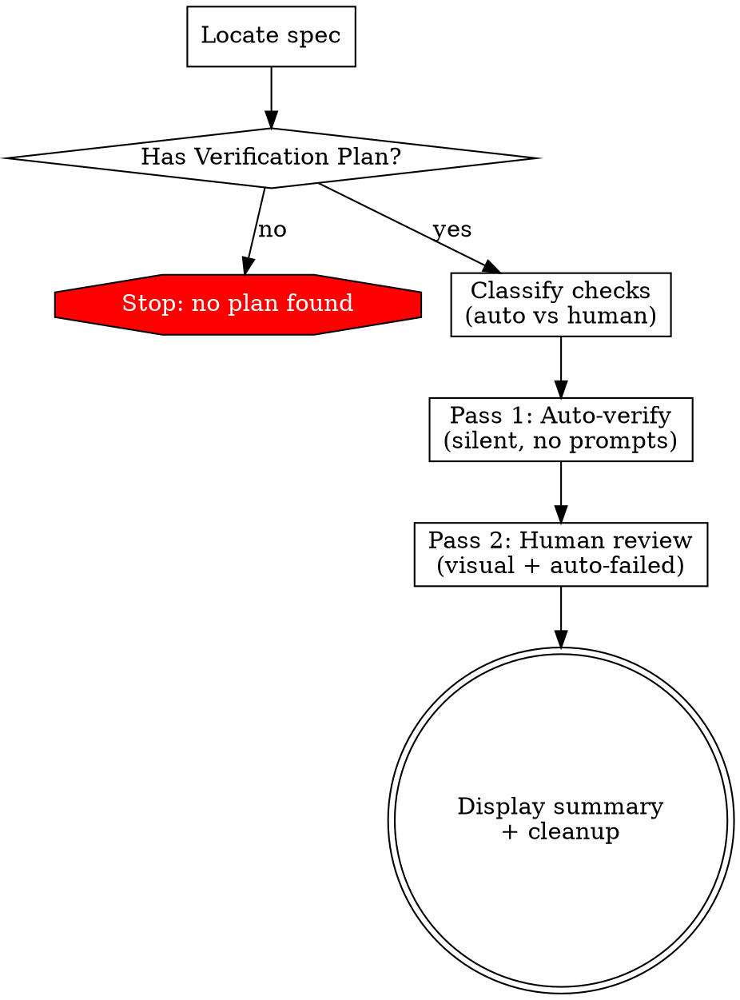

Verify a completed feature against its spec's Verification Plan using a two-pass approach: automated checks first, then human review only where needed.

## Process Flow



## Steps

### 1. Locate the Spec

- If `$ARGUMENTS` is a file path, use it.
- Otherwise, discover the most recent spec:
  - Glob `docs/**/specs/*.md` (covers `docs/specs/`, `docs/superpowers/specs/`, etc.)
  - Sort by filename (date-prefixed by convention), pick the latest.
  - Show the user which spec was selected. **Ask for confirmation before proceeding.**

### 2. Extract and Classify the Verification Plan

Read the spec. Look for a `## Verification Plan` or `### Verification Plan` section.

**If no Verification Plan is found: STOP.** Tell the user and stop. Do NOT improvise checks, infer checks from the spec body, or offer to create a plan.

**Classify each check as auto or human:**

| Check type | Classification | How to verify |
|---|---|---|
| Run a shell command (build, lint, test) | **auto** | Execute command, check exit code |
| Grep/search for pattern in code | **auto** | Run grep, check match found |
| Navigate to URL and verify it loads | **auto** | Browser navigate, check URL didn't redirect |
| Verify DOM element contains text | **auto** | Browser snapshot, check element text |
| Verify link hrefs match expected URLs | **auto** | Browser snapshot, inspect href attributes |
| Feature flag disables a section | **auto** | Navigate without flag, check redirect |
| i18n — switch language, text updates | **auto** | Click language switch, snapshot, check text changed |
| Visual layout, design quality, spacing | **human** | Screenshot + human judgment |
| Responsive layout at specific viewport | **human** | Resize + screenshot + human judgment |
| Subjective quality ("looks correct") | **human** | Screenshot + human judgment |

Present the classification to the user before starting:

```
## Verification Plan — 11 checks

**Auto (7):** #1 page loads, #3 source links, #4 counter text, #6 feature flag, #8 i18n, #10 lint, #11 build
**Human (4):** #2 entry display, #5 Home card, #7 mobile layout, #9 TODO comments

Running auto checks first...
```

### 3. Detect Playwright

Check if Playwright MCP tools are available (look for tools matching `playwright` or `browser`).

- **Available**: Use for both auto DOM checks and human visual checks.
- **Not available**: Auto DOM checks become human checks. Inform user: "Playwright not available — converting DOM checks to manual."

### 4. Pass 1: Auto-Verify (Silent)

Run all auto-classified checks without prompting the user. For each:

1. Execute the verification (command, grep, navigation, DOM snapshot).
2. Determine pass/fail based on objective criteria:
   - **Shell commands**: exit code 0 = pass
   - **Grep/search**: match found = pass
   - **Navigation**: URL matches expected = pass
   - **DOM text check**: expected text present = pass
   - **Link hrefs**: all URLs match expected = pass
3. Record result and evidence (command output, DOM snapshot excerpt, etc.).

**Do NOT prompt the user during this pass.** Run everything silently, collect results.

After all auto checks complete, show a brief progress report:

```
Auto-verify complete: 6/7 passed, 1 failed

Moving to human review (4 visual checks + 1 auto-failed)...
```

### 5. Pass 2: Human Review

Present to the human ONLY:
- **Visual checks** that need human eyes (screenshots)
- **Auto-failed checks** with the evidence so the human can confirm or override

**For visual checks:**
1. Announce the check.
2. Take Playwright screenshots at relevant viewports/states.
3. Present screenshots to the user (use Read tool to display inline).
4. Ask: **"Pass, fail, or skip?"**

**For auto-failed checks:**
1. Show what was checked and why it failed.
2. Show the evidence (command output, DOM content, etc.).
3. Ask: **"Confirm fail, override to pass, or skip?"**
   - Override allows the human to pass a check that auto-failed due to a false negative.

**Auto-passed checks are NOT shown to the human.** They're in the summary.

**Accepting user responses:**

Accept shorthand: `p` = pass, `f` = fail, `s` = skip. Also accept full words and mixed case.

**"Pass with noted issue" pattern:**

If the user passes but mentions a bug (e.g., "pass but the pluralization is wrong"), record as **pass** and add the issue to a **Noted Issues** list. These are non-blocking problems to fix.

### 6. Display Summary

```
## Verification Summary — [spec filename]

| Category      | Total | Passed | Failed | Skipped |
|---------------|-------|--------|--------|---------|
| Auto-verified |     7 |      6 |      1 |       0 |
| Human-judged  |     4 |      4 |      0 |       0 |
| **Total**     |**11** | **10** |  **1** |   **0** |

### Auto-Verified Checks
- [pass] #1 Navigate to /salud-democratica — page loaded (URL confirmed)
- [pass] #3 Source links — 5/5 hrefs match expected URLs
- [pass] #4 Event counter — text contains "2 eventos documentados"
- [FAIL] #6 Feature flag — page still loaded without flag (expected redirect)
- [pass] #8 i18n — text changed after language switch
- [pass] #10 Build — exit code 0
- [pass] #11 Lint — exit code 0

### Human-Judged Checks
- [pass] #2 Entry display — user approved
- [pass] #5 Home card layout — user approved
- [pass] #7 Mobile responsive — user approved at 375px

### Noted Issues (non-blocking)
- [#4] Pluralization shows singular for count=2
```

If all pass: "All checks passed. Feature is verified."
If any fail: list with details.

Results are **ephemeral** — shown in-session only, not written to files.

**Cleanup:** After displaying the summary, delete any screenshot files created during verification.

## When Auto-Verify Fails Unexpectedly

If an auto check fails for infrastructure reasons (dev server not running, wrong port, missing env var), **do not mark it as failed.** Instead:

1. Inform the user of the problem.
2. Ask them to fix it (start server, set env var, etc.).
3. Retry the check.

Only mark as failed when the check genuinely does not meet its expected outcome.

## What This Skill Does NOT Do

- **Does NOT create verification plans** — that's the architect's job during spec writing.
- **Does NOT persist results** — summary is shown in-session only.
- **Does NOT improvise checks** — if the spec has no Verification Plan, it stops.
- **Does NOT auto-verify visual/subjective checks** — those always need human eyes.
