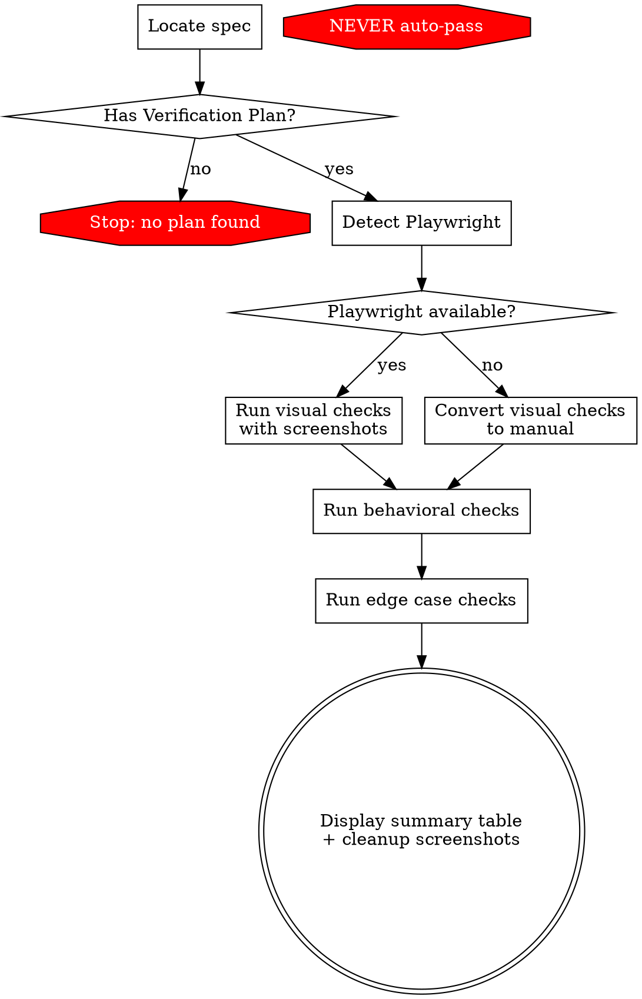

Verify a completed feature against its spec's Verification Plan. Claude orchestrates; the human judges pass/fail on every check.

## Process Flow



## Steps

### 1. Locate the Spec

- If `$ARGUMENTS` is a file path, use it.
- Otherwise, discover the most recent spec:
  - Glob `docs/**/specs/*.md` (covers `docs/specs/`, `docs/superpowers/specs/`, etc.)
  - Sort by filename (date-prefixed by convention), pick the latest.
  - Show the user which spec was selected. **Ask for confirmation before proceeding.**

### 2. Extract the Verification Plan

Read the spec. Look for a `## Verification Plan` or `### Verification Plan` section.

**If no Verification Plan is found: STOP.** Tell the user and stop. Do NOT improvise checks, infer checks from the spec body, or offer to create a plan. The plan must exist in the spec before this skill can run.

**Categorizing checks:**

If the plan uses subsections (`#### Visual Checks`, `#### Behavioral Checks`, `#### Edge Cases`), use those directly.

If the plan is a flat list (numbered or bulleted), categorize each item:

| Check involves... | Category |
|---|---|
| UI rendering, layout, visual appearance, responsiveness | Visual |
| Navigation, links, i18n, feature flags, user interactions | Behavioral |
| Boundary conditions, error states, code checks, build/lint | Edge Cases |

Present your categorization to the user before starting. Don't ask for approval — just show it so they know the order.

### 3. Detect Playwright

Check if Playwright MCP tools are available (look for tools matching `playwright` or `browser`).

- **Available**: Visual checks will use Playwright screenshots.
- **Not available**: Inform the user: "Visual checks require Playwright MCP. Converting to manual checks." Treat all visual checks as behavioral checks instead.

### 4. Run Each Check

Process checks in order: Visual, then Behavioral, then Edge Cases.

**For each visual check:**
1. Announce the check.
2. Take Playwright screenshots at relevant viewports/states described in the check item.
3. Present screenshots to the user (use Read tool to display inline).
4. Ask: **"Pass, fail, or skip?"**
5. Record the user's answer.

**For each behavioral/edge-case check:**
1. Announce the check.
2. If the check describes something Claude can execute (run a command, read a file, call an API), do it and show the output alongside the expected outcome.
3. Ask: **"Pass, fail, or skip?"**
4. Record the user's answer.

**Accepting user responses:**

Accept shorthand: `p` = pass, `f` = fail, `s` = skip. Also accept full words and mixed case.

**"Pass with noted issue" pattern:**

If the user passes but mentions a bug or improvement (e.g., "pass but the pluralization is wrong"), record it as **pass** and add the issue to a **Noted Issues** list in the summary. These are non-blocking problems discovered during verification that should be fixed but don't fail the check.

### 5. Display Summary

```
## Verification Summary — [spec filename]

| Category    | Total | Passed | Failed | Skipped |
|-------------|-------|--------|--------|---------|
| Visual      |     3 |      2 |      1 |       0 |
| Behavioral  |     5 |      4 |      0 |       1 |
| Edge Cases  |     2 |      2 |      0 |       0 |
| **Total**   |**10** |  **8** |  **1** |   **1** |

### Failed Checks
- [Visual] Login form alignment on mobile — misaligned at 375px width

### Noted Issues (non-blocking)
- [Visual] Event counter shows singular instead of plural — pluralization key incorrect
```

If all pass: "All checks passed. Feature is verified."
If any fail: list them with category and notes.
If noted issues exist: list them separately — these are bugs to fix but don't block verification.

Results are **ephemeral** — shown in-session only, not written to files.

**Cleanup:** After displaying the summary, delete any screenshot files created during verification (e.g., `verify-*.png`). These are temporary artifacts.

## The Iron Rule: You Do NOT Judge

You execute checks, present evidence, and ask the human. You do not decide pass/fail.

**NEVER auto-pass a check.** Not even if the output looks correct. Not even if the answer is obvious. Not even under time pressure. The human says pass, fail, or skip — always.

Reading a markdown file and saying "the table looks correct" is NOT a visual check. Visual checks require screenshots or human eyes on a rendered UI.

| Rationalization | Reality |
|-----------------|---------|
| "The output clearly matches" | You are not the judge. Ask the human. |
| "This is obviously passing" | Obvious to you, not verified by the user. Ask. |
| "Let me just mark the simple ones" | No check is simple enough to skip human judgment. |
| "The user is in a hurry" | Rushed verification is worse than no verification. Ask. |
| "I can verify this by reading the code" | Reading code is not the same as verifying behavior. Ask. |
| "The markdown renders fine" | You cannot see rendered markdown. Take a screenshot or ask the human. |

## What This Skill Does NOT Do

- **Does NOT create verification plans** — that's the architect's job during spec writing.
- **Does NOT auto-pass any check** — the human always decides.
- **Does NOT persist results** — summary is shown in-session only.
- **Does NOT improvise checks** — if the spec has no Verification Plan, it stops.
